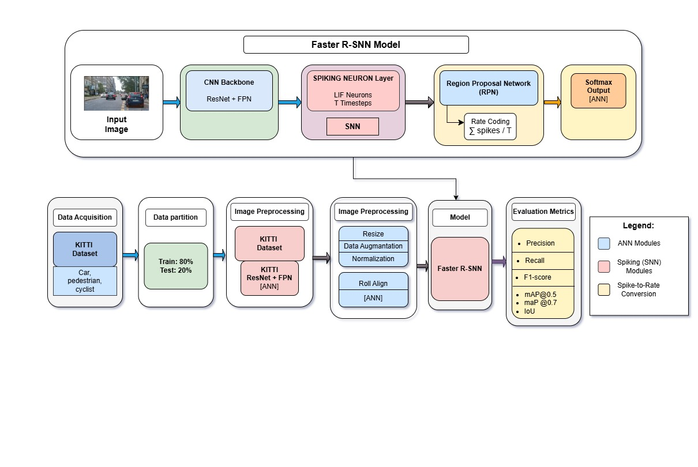
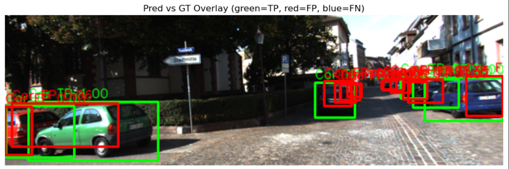
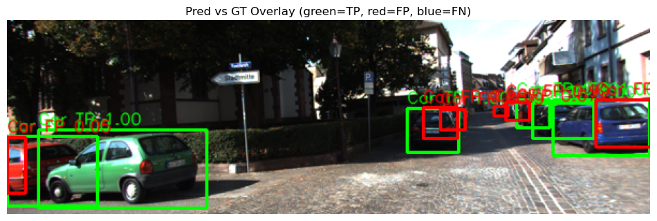
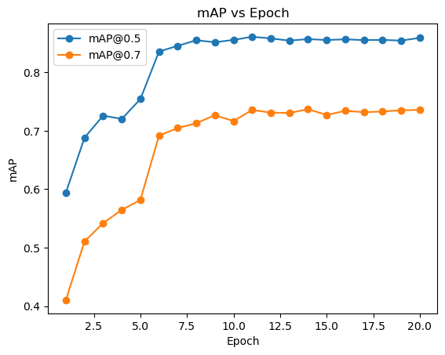
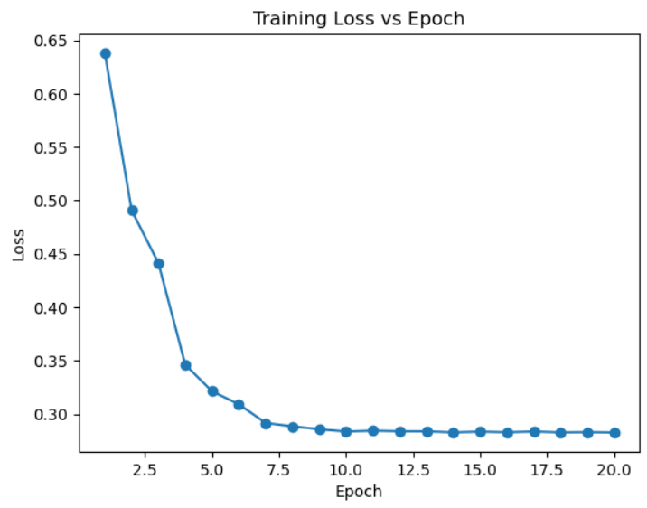
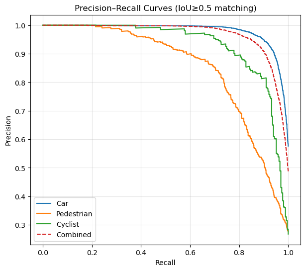
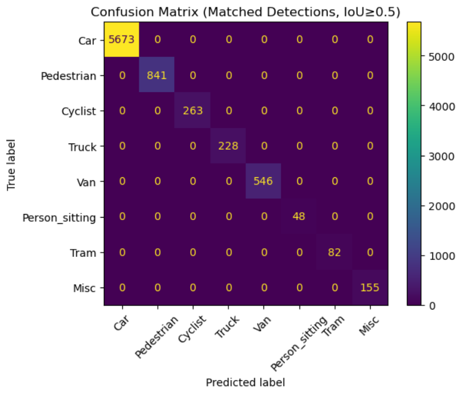
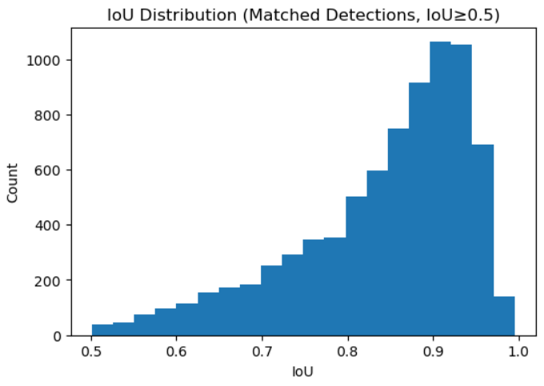

# Design and Analysis of a Hybrid Spiking–Deep Neural Network for Energy-Efficient Object Detection

## Overview

This repository documents my undergraduate thesis titled **"Design and Analysis of a Hybrid Spiking–Deep Neural Network for Energy-Efficient Object Detection."**

The objective of this research is to design and evaluate a hybrid object detection model that combines the strengths of **Deep Neural Networks (DNNs)** and **Spiking Neural Networks (SNNs)**. The proposed architecture aims to improve computational and energy efficiency while maintaining strong object detection performance.

Traditional deep learning models provide excellent accuracy but often require high computational resources. This research explores how spiking neural networks can be integrated into a deep learning framework to reduce computational cost while preserving detection accuracy. The proposed model is evaluated using standard object detection metrics and compared with conventional approaches.

This repository provides an overview of the research methodology, system architecture, experimental results, and performance analysis.

---

# Research Objectives

The main objectives of this research are:

- Design a hybrid SNN–DNN architecture for object detection.
- Study the integration of spiking neural networks into modern object detection models.
- Evaluate the performance of the proposed architecture.
- Analyze the trade-off between detection accuracy and computational efficiency.
- Explore the potential of hybrid neural networks for future energy-efficient AI applications.

---

# Research Workflow

The research was completed through the following stages:

1. Literature review on object detection, Deep Neural Networks, and Spiking Neural Networks.
2. Selection of the object detection framework.
3. Design of the proposed hybrid architecture.
4. Model implementation and training.
5. Performance evaluation.
6. Comparative analysis and discussion of the results.

---

# System Architecture

The following figure illustrates the proposed hybrid architecture developed in this research.

<p align="center">
  
</p>

---

# Object Detection Results

The following examples demonstrate the detection performance of the proposed model on sample images.

<p align="center">
  
  
</p>

---

# Performance Evaluation

The proposed model was evaluated using several standard object detection metrics, including:

- Precision
- Recall
- Mean Average Precision (mAP)
- Training Loss
- Intersection over Union (IoU)
- Confusion Matrix

The following figures summarize the experimental results.

## Mean Average Precision (mAP)

<p align="center">
  
</p>

## Training Loss

<p align="center">
  
</p>

## Precision–Recall Curve

<p align="center">
  
</p>

## Confusion Matrix

<p align="center">
  
</p>

## Intersection over Union (IoU)

<p align="center">
  
</p>

---

# Technologies Used

### Programming Language

- Python

### Research Areas

- Computer Vision
- Deep Learning
- Machine Learning
- Spiking Neural Networks (SNN)
- Deep Neural Networks (DNN)
- Object Detection
- Data Analysis

### Libraries and Frameworks

- PyTorch
- NumPy
- Matplotlib

---

# Repository Structure

```text
.
├── README.md
├── images
│   ├── architecture.png
│   ├── detection_result_1.png
│   ├── detection_result_2.png
│   ├── map_curve.png
│   ├── training_loss.png
│   ├── precision_recall.png
│   ├── confusion_matrix.png
│   └── iou_distribution.png
```

---

# Thesis Information

**Title**

Design and Analysis of a Hybrid Spiking–Deep Neural Network for Energy-Efficient Object Detection

**Project Type**

Undergraduate Thesis

**Status**

Completed and Successfully Defended

---

# Future Work

Possible future improvements include:

- Optimization for neuromorphic hardware.
- Evaluation on larger object detection datasets.
- Deployment on embedded and edge AI devices.
- Further reduction of computational complexity and energy consumption.
- Investigation of additional spike encoding and learning methods.

---

# Note

This repository is intended to document the research completed as part of my undergraduate thesis. The implementation source code is not included in this repository. The purpose of this repository is to present the research methodology, experimental evaluation, and key findings for academic and portfolio purposes.

---

# License

This repository is shared for academic and portfolio purposes. All rights to the thesis remain with the author.
